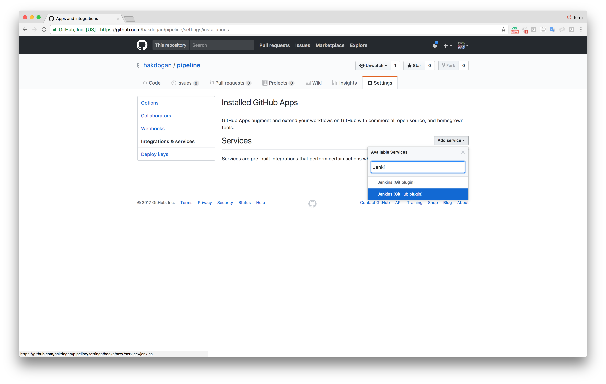
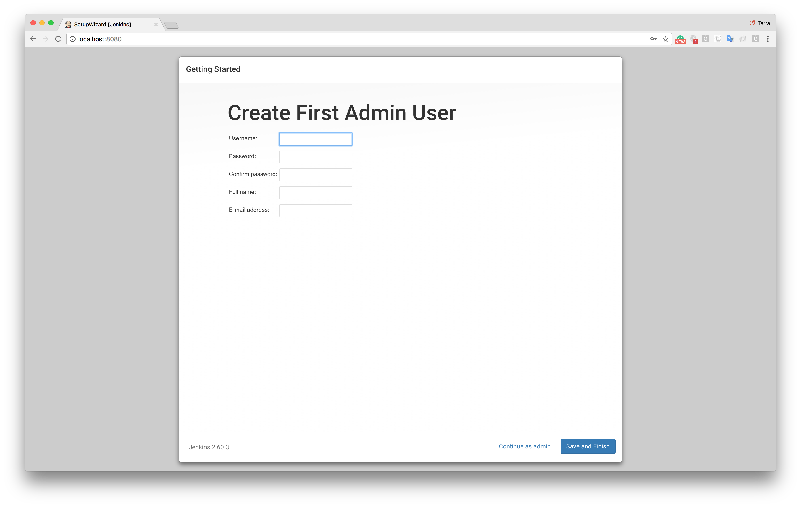
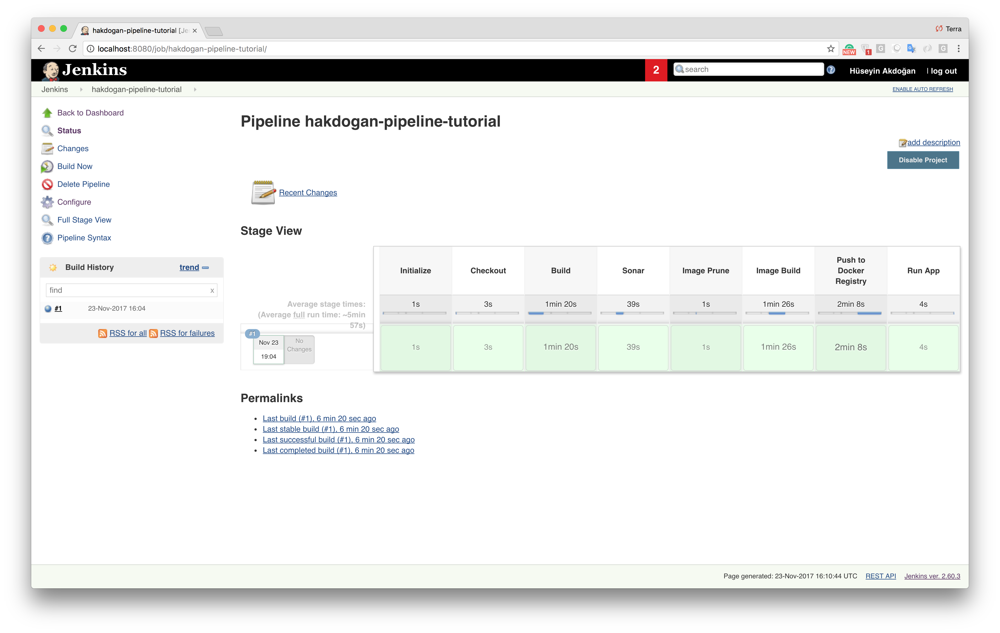

[](https://github.com/igrigorik/ga-beacon)

# Un tutoriel sur l'integration continue et le deploiement continue en utilisant Docker dans un Pipeline Jenkins 

Ce référentiel est un didacticiel qui tente d'illustrer comment gérer automatiquement le processus de création, de test avec la couverture la plus élevée et les phases de déploiement.

Notre objectif est de nous assurer que notre pipeline fonctionne bien après chaque envoi de code. 
Les processus que nous voulons gérer automatiquement : 
* Verifier le code 
* Exécuter des tests 
* Compiler le code 
* Exécuter l'analyse Sonarqube sur le code 
* Créer une image Docker 
* Pousser l'image vers Docker Hub 
* Extraire et exécuter l'image

## Premiere etape, lancer les services

Puisque l'un des objectifs est d'obtenir le rapport ''sonarqube'' de notre projet, nous devrions pouvoir accéder à sonarqube depuis le service jenkins. ''Docker compose'' est le meilleur choix pour exécuter des services travaillant ensemble. Nous configurons nos services applicatifs dans un fichier yaml comme ci-dessous.

``docker-compose.yml``
```yml
version: '3.2'
services:
  sonarqube:
    build:
      context: sonarqube/
    ports:
      - 9000:9000
      - 9092:9092
    container_name: sonarqube
  jenkins:
    build:
      context: jenkins/
    privileged: true
    user: root
    ports:
      - 8080:8080
      - 50000:50000
    container_name: jenkins
    volumes:
      - /tmp/jenkins:/var/jenkins_home #N'oubliez pas que le répertoire tmp est conçu pour être effacé au redémarrage du système.
      - /var/run/docker.sock:/var/run/docker.sock
    depends_on:
      - sonarqube
```

Les chemins d'accès des fichiers docker des conteneurs sont spécifiés dans l'attribut context dans le fichier docker-compose. Contenu de ces fichiers comme suit.

``sonarqube/Dockerfile``
```
FROM sonarqube:6.7-alpine
```

``jenkins/Dockerfile``
```
FROM jenkins:2.60.3
```

Si nous exécutons la commande suivante dans le même répertoire que le fichier ''docker-compose.yml'', les conteneurs Sonarqube et Jenkins seront opérationnels.
```
docker-compose -f docker-compose.yml up --build
```

```
docker ps

CONTAINER ID        IMAGE                COMMAND                  CREATED              STATUS              PORTS                                              NAMES
87105432d655        pipeline_jenkins     "/bin/tini -- /usr..."   About a minute ago   Up About a minute   0.0.0.0:8080->8080/tcp, 0.0.0.0:50000->50000/tcp   jenkins
f5bed5ba3266        pipeline_sonarqube   "./bin/run.sh"           About a minute ago   Up About a minute   0.0.0.0:9000->9000/tcp, 0.0.0.0:9092->9092/tcp     sonarqube
```

## GitHub configuration
Nous allons définir un service sur Github pour appeler le ''Jenkins Github webhook'' car nous voulons déclencher le pipeline. Pour ce faire, allez à _Settings -> Intégrations et services._ Le ''plugin Jenkins Github'' devrait être affiché dans la liste des services disponibles comme ci-dessous.



Après cela, nous devrions ajouter un nouveau service en tapant l'URL du conteneur Jenkins dockerisé avec le chemin ''/github-webhook/''.


L'étape suivante consiste à créer une ''clé SSH'' pour un utilisateur Jenkins et à la définir comme ''Déployer des clés'' sur notre référentiel GitHub.


Si tout se passe bien, la demande de connexion suivante devrait revenir avec succès.
```
ssh git@github.com
PTY allocation request failed on channel 0
Hi <your github username>/<repository name>! You've successfully authenticated, but GitHub does not provide shell access.
Connection to github.com closed.
```

## Jenkins configuration

Nous avons configuré Jenkins dans le fichier de composition docker pour fonctionner sur le port 8080, donc si nous visitons http://localhost:8080 nous serons accueillis avec un écran comme celui-ci.


Nous avons besoin du mot de passe administrateur pour procéder à l'installation. Il est stocké dans le répertoire ''/var/jenkins_home/secrets/initialAdminPassword'' et est également écrit en sortie sur la console lorsque Jenkins démarre.

```
jenkins      | *************************************************************
jenkins      |
jenkins      | Jenkins initial setup is required. An admin user has been created and a password generated.
jenkins      | Please use the following password to proceed to installation:
jenkins      |
jenkins      | 45638c79cecd4f43962da2933980197e
jenkins      |
jenkins      | This may also be found at: /var/jenkins_home/secrets/initialAdminPassword
jenkins      |
jenkins      | *************************************************************
```

Pour accéder au mot de passe à partir du conteneur.

```
docker exec -it jenkins sh
/ $ cat /var/jenkins_home/secrets/initialAdminPassword
```

Après avoir entré le mot de passe, nous téléchargerons les plugins recommandés et définirons un ''utilisateur administrateur''.




Après avoir cliqué sur les boutons **Enregistrer et terminer** et **Commencer à utiliser Jenkins**, nous devrions voir la page d'accueil Jenkins. L'un des sept objectifs énumérés ci-dessus est que nous devons avoir la capacité de construire une image dans le Jenkins en cours de dockerisation. Examinez les définitions de volume du service Jenkins dans le fichier de composition.
```
- /var/run/docker.sock:/var/run/docker.sock
```

Le but est de communiquer entre le ''Docker Daemon'' et le ''Docker Client'' (_nous l'installerons sur Jenkins_) sur le socket. Comme le client docker, nous avons également besoin de ''Maven'' pour compiler l'application. Pour l'installation de ces outils, nous devons effectuer les configurations ''Maven'' et ''Docker Client'' sous _Manage menu Jenkins -> Global Tool Configuration_.


Nous avons ajouté les ''installateurs Maven et Docker'' et avons coché la case ''Installer automatiquement''. Ces outils sont installés par Jenkins lors de la première exécution de notre script . Nous donnons des noms ''myMaven'' et ''myDocker'' aux outils. Nous accéderons à ces outils avec ces noms dans le fichier de script.

Étant donné que nous allons effectuer certaines opérations telles que ''checkout codebase'' et ''push an image to Docker Hub'', nous devons définir les ''Docker Hub Credentials''. Gardez à l'esprit que si nous utilisons un **référentiel privé**, nous devons définir ''Informations d'identification Github''. Ces définitions sont effectuées sous _Jenkins Page d'accueil -> Informations d'identification -> Informations d'identification globales (sans restriction) -> menu Ajouter Credentials_.


Nous utilisons la valeur que nous avons entrée dans le champ ''ID'' pour Docker Login dans le fichier de script. Maintenant, nous définissons le pipeline sous _Jenkins Home Page -> New Item_ menu.


Dans cette étape, nous sélectionnons les options ''GitHub hook trigger for GITScm pooling'' pour l'exécution automatique du pipeline par l'appel du ''Github hook''.


Toujours dans la section Pipeline, nous sélectionnons le ''Script de pipeline à partir du GDS'' comme Définition, définissons le référentiel GitHub et le nom de la branche, et spécifions l'emplacement du script (_[Jenkins file](https://github.com/hakdogan/jenkins-pipeline/blob/master/Jenkinsfile)_).


Après cela, lorsqu'un push est effectué vers le référentiel distant ou lorsque vous déclenchez manuellement le pipeline par l'option ''Construire maintenant'', les étapes décrites dans le fichier Jenkins seront exécutées.



## Points importants sur le Jenkinsfile

```
stage('Initialize'){
    def dockerHome = tool 'myDocker'
    def mavenHome  = tool 'myMaven'
    env.PATH = "${dockerHome}/bin:${mavenHome}/bin:${env.PATH}"
}
```

Les outils ``Maven`` et ``Docker client`` que nous avons définis dans Jenkins sous _Global menu Configuration_ outils sont ajoutés à la ``variable d'environnement PATH`` pour utiliser ces outils avec ``sh command``.

```
stage('Push to Docker Registry'){
    withCredentials([usernamePassword(credentialsId: 'dockerHubAccount', usernameVariable: 'USERNAME', passwordVariable: 'PASSWORD')]) {
        pushToImage(CONTAINER_NAME, CONTAINER_TAG, USERNAME, PASSWORD)
    }
}
```

``withCredentials`` fournis par ``Jenkins Credentials Binding Plugin`` et lier les informations d'identification aux variables. Nous avons transmis la valeur **dockerHubAccount** avec le parametre ``credentialsId``. N'oubliez pas que la valeur dockerHubAccount est l'ID d'informations d'identification Docker Hub, que nous avons défini sous _Jenkins Home Page -> Credentials -> Global credentials (unrestricted) -> Add Credentials_ menu. De cette façon, nous accédons aux informations de nom d'utilisateur et de mot de passe du compte pour la connexion.

## Sonarqube configuration

For ``Sonarqube`` we have made the following definitions in the ``pom.xml`` file of the project.

```xml
<sonar.host.url>http://sonarqube:9000</sonar.host.url>
...
<dependencies>
...
    <dependency>
        <groupId>org.codehaus.mojo</groupId>
        <artifactId>sonar-maven-plugin</artifactId>
        <version>2.7.1</version>
        <type>maven-plugin</type>
    </dependency>
...
</dependencies>
```

Dans le fichier docker compose, nous avons donné le nom du service Sonarqube qui est``sonarqube``, c'est pourquoi dans le fichier ``pom.xml``, l'url Sonar est definie par http://sonarqube:9000.
